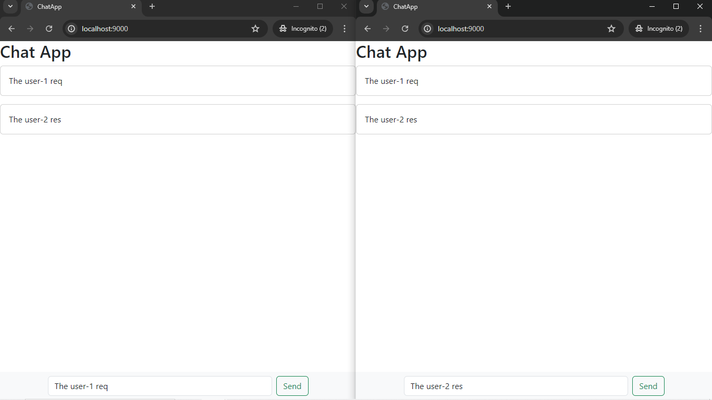

## ChatHost: A Real-Time Chat Application with Express and Socket.IO

**Overview**

ChatHost is a web-based chat application developed using Express and Socket.IO. It facilitates real-time communication among users, enabling them to connect and interact in an engaging and efficient manner.

**Features**

* **Real-time Messaging:** Messages are delivered instantly between users, fostering seamless and dynamic conversations.
* **Global Chat Functionality:** Messages are delivered instantly to all connected users, fostering a sense of community and promoting active engagement.
* **Responsive Design:** The application adapts its layout to different screen sizes (desktop, mobile, tablet) using Bootstrap, providing an excellent user experience on all devices.

**Prerequisites**

* Node.js and npm (or yarn) installed on your system.
* A basic understanding of JavaScript, Express, and Socket.IO concepts.

**Installation**

1. Clone this repository:
   ```bash
   git clone https://github.com/devanshdhingra/ChatApp.git
2. Install dependencies::
   ```bash
   npm install  # or yarn install
**Running the Application**

1. Start the server:
   ```bash
   npm start  # or yarn start
2. Access ChatHost in your web browser::
   ```bash
   http://localhost:9000  # Or the custom port you configured
**Development**
* Feel free to modify the code as needed to add new features or customize the application.
* Refer to the Express and Socket.IO documentation for more advanced usage:
    * Express: [https://expressjs.com/](https://expressjs.com/)
    * Socket.IO: [https://socket.io/get-started/](https://socket.io/get-started/)   

